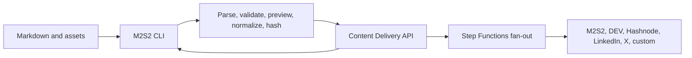
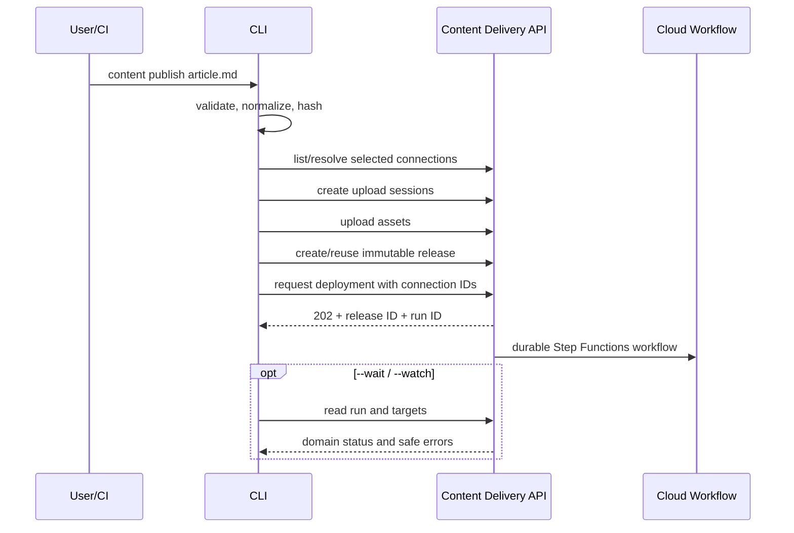

# M2S2 CLI Content Delivery Integration: Architecture and Roadmap

## Document status

- Status: proposed implementation baseline
- Repository: current Rust `m2s2-cli`
- Cloud dependency: `apps/content-delivery` in the M2S2 platform monorepo
- Decision: retain publishing as a remote client; retain direct adapters only as an explicit migration mode

## 1. Executive decision

Do not remove publishing from the CLI. The CLI remains the interface for Markdown authors, Git
repositories, local preview, automation, and CI/CD. In remote mode it validates and uploads an
immutable release, selects verified workspace connections, and requests a deployment. The cloud
service stores credentials and executes the Step Functions workflow.

The CLI does not need to understand Step Functions, Lambda, DynamoDB, or connector internals. It
uses stable release, connection, deployment, target, draft, and approval APIs. A successful
asynchronous request means the run was durably accepted—not that every destination succeeded.

## 2. Boundary



### CLI owns

- Project and article discovery.
- YAML frontmatter/Markdown parsing.
- Canonical schema validation and deterministic normalization.
- Local link, image, asset, size, and path checks.
- Preview/rendering.
- Source and asset SHA-256 digests.
- Presigned upload coordination.
- Cognito authentication to the content API.
- Workspace/connection selection.
- Release, preflight, deployment, status, retry, and approval requests.
- Stable human and JSON output for automation.
- Offline declarative connector-definition validation.
- Explicit legacy direct execution while supported.

### Cloud service owns

- Organizations, workspaces, roles, and entitlements.
- Connector catalog, definitions, versions, and capabilities.
- Connection configuration and destination credentials.
- Remote credential verification and preflight.
- Immutable accepted releases and deployment state.
- Step Functions fan-out, retries, approval callbacks, and reconciliation.
- Remote publication IDs/URLs and audit history.
- Hosted AI drafts, subscriptions, usage, and billing.

### Hard boundary

In remote mode, the CLI never downloads destination credentials, calls destination APIs, starts AWS
workflows directly, or reads infrastructure state. It calls only the public content-delivery API.

## 3. Rust organization

Recommended logical crates/modules:

```text
crates/
  m2s2-content-model/       Canonical schema, normalization, digests
  m2s2-content-local/       Markdown/frontmatter/assets/preview/checks
  m2s2-delivery-client/     Versioned API and auth models
  m2s2-direct-publish/      Existing adapters; migration/self-hosted only
  m2s2-cli-core/            Config, output, command application services
src/commands/
  auth.rs
  organization.rs
  workspace.rs
  connection.rs
  connector.rs
  content/
  publish_compat.rs
```

If a Cargo workspace is too disruptive now, enforce these as module boundaries and extract after
behavior stabilizes. Share implementation with Go only through OpenAPI, JSON Schema, event schemas,
and golden normalization/digest fixtures.

These reusable crates make a separately branded content-delivery CLI possible later without forcing
SaaS customers to install design-system scaffolding features.

## 4. Command surface

### Authentication and context

```text
m2s2 auth login [--profile <name>]
m2s2 auth status [--profile <name>]
m2s2 auth logout [--profile <name>] [--revoke]

m2s2 organization list
m2s2 workspace list
m2s2 workspace use <workspace>
m2s2 workspace current
```

### Local authoring

```text
m2s2 content init [path]
m2s2 content validate <file> [--offline] [--format human|json]
m2s2 content preview <file> [--open]
m2s2 content inspect <file> [--format human|json]
```

Offline validation remains available without login or a paid plan.

### Connections and targets

```text
m2s2 connector catalog
m2s2 connector show <connector-key>
m2s2 connection list
m2s2 connection verify <connection-id>
```

Ordinary secret/OAuth connection setup should open the web portal because terminals are a poor place
for payment and complex OAuth/secret forms:

```text
m2s2 connection add <connector-key> [--open]
m2s2 connection manage <connection-id> [--open]
```

### Remote content workflow

```text
m2s2 content preflight <file> [--connections <ids>] [--wait]
m2s2 content publish <file> [--connections <ids>] [--wait]
m2s2 content status [run-id] [--watch] [--format human|json]
m2s2 content history [file-or-content-id]
m2s2 content retry <run-id> --target <target-id>
m2s2 content approve <run-id> --target <target-id> [--draft <file>]
m2s2 content reject <run-id> --target <target-id> [--reason <text>]
m2s2 content unpublish <run-id> --target <target-id> [--yes]
```

Prefer connection IDs over connector names because a workspace can configure multiple Hashnode or
DEV accounts. Friendly aliases may resolve to connection IDs locally.

### Custom connector development

```text
m2s2 connector init <name>
m2s2 connector validate <connector.yaml> [--offline]
m2s2 connector test <connector.yaml> --fixture <release.json>
m2s2 connector push <connector.yaml>
m2s2 connector publish <connector-key> --version <version>
```

The CLI validates declarative definitions and uploads them. The service performs authoritative
security, network, ownership, and entitlement validation. The CLI never uploads arbitrary
executables/scripts under this workflow.

### Account/billing

```text
m2s2 account usage
m2s2 account billing [--open]
```

The CLI never collects payment-card details. Entitlement failures print the missing capability and
an authenticated portal URL.

### Compatibility alias

```text
m2s2 publish <file>  ->  m2s2 content publish <file>
```

Legacy repositories retain direct behavior until explicitly migrated. Print the selected execution
mode before any side effect.

## 5. Configuration

### Repository configuration

Use commit-safe `.m2s2/config.toml`:

```toml
schema_version = 1

[content]
articles_dir = "articles"
assets_dir = "assets"
canonical_base_url = "https://m2s2.io/blog"

[delivery]
profile = "production"
organization = "m2s2-engineering"
workspace = "m2s2-site"
execution = "remote"
default_policy = "default-syndication"
default_connections = ["m2s2-site", "devto-primary", "hashnode-primary"]
wait = false

[delivery.approvals]
linkedin = true
x = true
```

Do not store service tokens, destination credentials, OAuth data, task tokens, secret references, or
Stripe data here.

### Global profile configuration

```text
Linux:   $XDG_CONFIG_HOME/m2s2/config.toml or ~/.config/m2s2/config.toml
macOS:   ~/Library/Application Support/m2s2/config.toml
Windows: %APPDATA%\m2s2\config.toml
```

```toml
[profiles.production]
api_url = "https://delivery-api.m2s2.io/v1"
auth_issuer = "https://<cognito-domain>"
auth_client_id = "<public-cli-app-client-id>"
auth_scopes = ["openid", "email", "profile"]

[profiles.local]
api_url = "http://localhost:8082/v1"
```

Reject insecure HTTP except loopback or an explicit development override.

### Credentials

- Interactive refresh credentials use the OS credential manager.
- Config stores only the credential entry/profile metadata.
- CI uses `M2S2_TOKEN` or `--token-stdin`, not a command-line token flag.
- Service tokens are workspace-scoped and minimally privileged.
- Destination credentials are connected through the web/service and never migrated into remote CLI
  config.
- Redact authorization headers, token-like values, and presigned URL query strings.

### Precedence

1. Explicit flags.
2. Purpose-specific environment variables.
3. Repository `.m2s2/config.toml`.
4. Selected global profile.
5. Safe defaults.

`content inspect` shows effective non-secret configuration and source.

### Legacy migration

Continue reading `.m2s2-publish.toml` only for direct mode. Add:

```text
m2s2 content migrate-config
```

It writes safe project configuration, identifies credentials that must be reconnected in the portal,
and never copies or deletes secrets automatically.

## 6. Cognito authentication

Create a separate public Cognito app client for the CLI while preserving the existing user pool and
web app client. Prefer OAuth authorization code with PKCE and an explicitly registered loopback
callback. Cognito does not require a client secret for a public CLI client.

Interactive requirements:

- cryptographically random state and PKCE verifier;
- exact issuer/client/audience/token validation;
- short-lived access token and securely stored refresh credential;
- fixed/registered loopback callback or product-approved alternative;
- print login URL when automatic browser opening fails;
- timeout/cancel without partial credential state;
- display signed-in subject, organization, workspace, and scopes.

For CI, use organization-managed service tokens created in the portal. If workload federation is
added later, preserve the same application scopes.

`auth logout` removes the local credential; `--revoke` also requests server-side token-family
revocation when online.

## 7. Canonical article preparation

### Baseline frontmatter

```yaml
---
title: Architecture Is Built for Change
slug: architecture-is-built-for-change
summary: Why adaptability is an architectural quality.
tags:
  - architecture
  - software-design
canonical_url: https://m2s2.io/blog/architecture-is-built-for-change
cover_image: ./assets/architecture-change.png
---
```

Validate:

- required title, slug, summary, canonical URL, tags, and content;
- duplicate/invalid slug;
- local links and asset existence;
- media type and size;
- paths/symlinks outside content root;
- target-independent size constraints;
- unresolved placeholders and invalid controls/Unicode;
- schema version compatibility.

Remote preflight remains authoritative because it has live connections, credentials, connector
versions, provider contracts, entitlements, and network access.

### Normalization/digest

The shared contract defines line endings, Unicode, metadata ordering, Markdown whitespace, asset
digests, and canonical serialization. Compute SHA-256 and send algorithm/schema version. The server
independently normalizes and verifies; a mismatch is a hard error.

Golden fixtures must produce the same digest in Rust, Go, and web mapping tests.

### Asset uploads

1. Discover referenced local assets.
2. Validate path, symlink, media type, size, and checksum.
3. Request presigned upload sessions.
4. Upload only missing blobs with bounded concurrency/retry.
5. Create the release with returned asset IDs/checksums.

Do not pass local filesystem paths or asset bytes through the release JSON.

## 8. Remote deployment sequence



### Idempotency

```text
release:    cli:{workspace-id}:{relative-path}:{source-digest}
deployment: cli:{workspace-id}:{release-id}:{operation}:{selected-connection-digest}
```

On ambiguous API response, retry with the same key. Store recent run references locally only as a
convenience.

### Target selection

Resolution order:

1. Explicit `--connections` IDs/aliases.
2. Repository `default_connections`.
3. Service deployment policy defaults.

Before uploading, print selected workspace/connections in interactive mode. In CI JSON output, emit
the resolved IDs without secret/config values.

### Wait/watch

- Default prints release ID, run ID, status URL, and exits after durable acceptance.
- `--wait` waits for success, partial failure, failure, blocked, or approval required.
- `--watch` uses service streaming only if published; otherwise bounded polling.
- Ctrl+C stops watching but does not cancel the cloud workflow.
- Timeout prints recovery/status command and returns a distinct exit code.

## 9. Output and exit contract

`--format json` is a versioned automation contract:

```json
{
  "schemaVersion": 1,
  "releaseId": "rel_123",
  "runId": "run_456",
  "status": "partially_failed",
  "targets": [
    {"targetId": "td_1", "connector": "devto", "status": "succeeded", "remoteUrl": "https://..."},
    {"targetId": "td_2", "connector": "hashnode", "status": "failed", "errorCode": "rate_limited", "retryable": true}
  ]
}
```

| Code | Meaning |
|---:|---|
| 0 | Local operation succeeded, or remote work durably accepted without `--wait` |
| 2 | Usage/configuration error |
| 3 | Local validation failed |
| 4 | Authentication/authorization failed |
| 5 | Entitlement required |
| 6 | Remote preflight blocked |
| 7 | Run failed or partially failed while waiting |
| 8 | Approval required while waiting |
| 9 | Network/service unavailable or wait timeout |
| 10 | Direct connector failure |

Document clearly that asynchronous code `0` means accepted, not delivered.

## 10. Direct and remote modes

```bash
m2s2 content publish article.md --execution remote
m2s2 content publish article.md --execution direct
```

Resolution:

1. Explicit flag.
2. Repository configuration.
3. Legacy repository detection chooses direct and prints migration guidance.
4. New connected projects default to remote only after hosted GA.

Never fall back automatically from remote to direct after auth, entitlement, network, or service
failure. That could use unexpected local credentials and create duplicates.

Direct mode retains the existing DEV/Hashnode/generic adapters, legacy credentials, full-target
preparation, offline contract validation, and minimal publication state. It does not provide hosted
Step Functions orchestration, centralized credentials, audit, approvals, billing, or durable
multi-user state.

Do not remove direct mode until remote stability, migration tooling, notice period, self-hosting
alternative, and active-user evidence satisfy a documented deprecation policy. It may later move to
an optional crate/package.

## 11. AI draft workflow

The CLI requests hosted generation tied to an immutable release and target. It can display/download
a draft, submit edits with optimistic concurrency, and explicitly approve/reject. The service owns
the callback token and resumes Step Functions.

Local sidecar metadata records draft ID/version, target, release digest, and content hash. Approval
fails if stale. Optional local AI generation remains an authoring utility; it must upload/validate a
draft before hosted publication and is not automatically approved.

## 12. Custom connectors

The CLI supports advanced declarative connector authoring without executing production delivery:

- initialize definition/fixture;
- validate schemas, operations, templates, allowed hosts, response mappings, and version;
- render a prepared request against a local fixture with secrets redacted;
- upload a draft definition;
- request server validation/test/publication;
- display immutable version and connection upgrade requirements.

Offline validation is advisory. The hosted service enforces SSRF/egress, secret isolation,
ownership, entitlement, test connection, and publication policy. Customer-hosted remote connectors
use a separate signed agent protocol; arbitrary code is not uploaded through the CLI.

## 13. API client compatibility

- Pin the service OpenAPI 3.1 artifact.
- Prefer a small handwritten transport/application wrapper around generated models if needed.
- Send `User-Agent: m2s2-cli/<version>` and correlation/request ID.
- Enforce connect/request/overall deadlines.
- Retry only safe/idempotent calls with the same key; honor `Retry-After`.
- Parse `application/problem+json` into stable CLI errors.
- Ignore unknown additive response fields.
- Fail CI on generated model/fixture drift.
- Expose compatible API range in `m2s2 --version` diagnostics.

The CLI never consumes Step Functions execution history or AWS SDK credentials for remote mode.

## 14. Security

- Treat articles, manifests, API errors, and drafts as untrusted.
- Prevent path traversal and symlink escape during asset discovery.
- Require TLS; development HTTP is loopback-only.
- Store interactive credentials in OS keyring and CI tokens in CI secret stores.
- Never print tokens, destination credentials, presigned query strings, article bodies, task tokens,
  secret references, or raw provider responses.
- Apply file/body/redirect/timeout limits.
- Confirm unpublish, revocation, connector publication, and overwrite of human-edited drafts.
- Verify downloaded contract/update artifacts by pinned source/checksum/signature.
- Never execute code or commands from a connector definition.

## 15. Testing

### Unit

- Frontmatter/canonical validation.
- Path/symlink safety.
- Normalization/digest golden vectors.
- Configuration precedence and legacy detection.
- Keyring abstraction with fake backend.
- Cognito PKCE state/verifier behavior.
- Connection alias resolution and target digest.
- Idempotency stability.
- Problem/exit-code mapping and JSON snapshots.
- Direct/remote selection with no fallback.
- Declarative connector offline validation/redaction.

### HTTP/client

- Presigned asset orchestration.
- Release create/reuse/conflict.
- Connection listing/verification.
- Deployment accepted, blocked, partial, approval, retry, and unpublish.
- 401/403, entitlement, 409, 429, 5xx, timeout, malformed success, additive fields.
- No credential/content leakage in errors.

### Contract

- Rust models/client versus pinned OpenAPI.
- Release/digest fixtures shared with Go and Angular.
- Connector-definition JSON Schema.
- CLI JSON output schema.

### CLI integration

- Offline validate makes no network call.
- Remote publish uploads only missing assets and emits run ID.
- `--wait` maps terminal/approval states correctly.
- Ctrl+C leaves the remote run active and prints recovery command.
- Duplicate invocation reuses semantic release/run.
- Legacy project remains direct until migrated.
- Remote requests contain connection IDs but no destination credentials.

No ordinary CI test requires a real AWS, destination, AI, or Stripe credential.

## 16. CLI CI/CD changes

- Add controlled contract-update workflow; never consume an unpinned moving service schema.
- Validate generated models and shared fixtures.
- Run format, lint, unit/integration, advisory, license, and secret scans.
- Test Linux/macOS/Windows config and keyring behavior.
- Test supported release binaries and JSON snapshots.
- Preserve cargo-dist/npm/crates.io releases.
- Put development-service smoke tests in a separately authorized job.
- Roll out remote mode behind explicit config before changing defaults.
- Never embed Cognito client secrets, production tokens, or AWS credentials.

## 17. Roadmap

### Phase 0 — stabilize current publishing domain

- Extract article, validation, preparation, preflight, and publication outcome from command glue.
- Prepare all direct targets before writes.
- Add pinned DEV/Hashnode validation and malformed-success handling.
- Add stable machine-readable validation.
- Preserve `m2s2 publish` behavior.

Exit: current direct path is deterministic and fully mock-tested.

### Phase 1 — local content experience

- Add `content init`, `validate`, `inspect`, and `preview`.
- Add `.m2s2/config.toml` and migration diagnostics.
- Implement normalization/digest/assets and shared golden fixtures.
- Define JSON output and exit codes.

Exit: authors can completely validate the canonical release offline.

### Phase 2 — Cognito and remote client

- Add profiles, PKCE login with CLI app client, keyring, service tokens, organization/workspace
  commands.
- Add versioned API client, connection listing, and problem mapping.
- Add asset upload, release creation, preflight, deployment, status, and `--wait`.
- Make remote explicitly opt-in.

Exit: CLI submits to the development Step Functions-backed service without destination secrets.

### Phase 3 — operational workflow

- History, retry, cancel/unpublish, connection verification, and usage.
- Draft download/edit/upload, approve/reject with staleness checks.
- `--watch`, shell completions, CI examples, migration command, and portal links.

Exit: Git/Markdown and CI users perform routine remote publishing without the editor, except payment
and complex connection setup.

### Phase 4 — dual-mode dogfood

- Compare direct/remote canonical payloads and outcomes using shared fixtures.
- Publish M2S2 production content through the hosted workflow.
- Fix parity/recovery issues and collect stability evidence.
- Allow repository `execution = "remote"`; always print mode.

Exit: remote handles production content and partial-failure recovery for the defined stability window.

### Phase 5 — platform-first default

- Default new connected projects to remote.
- Remove destination-secret setup from new CLI flows.
- Keep local validation/preview free and offline.
- Keep direct explicit for legacy/self-hosted/connector development.
- Publish deprecation/extraction policy if direct adapters will move.

Exit: hosted workflow is normal and no existing project changed silently.

### Phase 6 — custom connector tooling

- Declarative definition init/schema/fixture/validation commands.
- Server draft/test/publish/version workflow.
- Organization/workspace ownership and connection upgrade UX.
- Customer-hosted agent diagnostics after the remote protocol exists.

Exit: advanced users develop a connector without service source changes or arbitrary hosted code.

### Phase 7 — independent product CLI option

- Extract reusable model/local/client crates.
- Decide product name/binary based on commercial discovery.
- Build a thin standalone CLI if warranted while preserving contract parity.

## 18. Required decisions

1. Final content API URL and product name.
2. Cognito CLI app-client callback/PKCE configuration.
3. Canonical normalization specification.
4. Immediate Cargo workspace versus module-first refactor.
5. Direct-mode support/stability window.
6. CI service token versus future workload federation.
7. JSON output compatibility policy.
8. Local AI generation after hosted generation.
9. Connector aliases versus IDs in commit-safe configuration.

## 19. Definition of done

CLI integration is complete when local validation is reliable offline, Cognito credentials are stored
safely, immutable releases are digest-verified/idempotent, selected connections are explicit,
asynchronous target results have stable human/JSON output, CI uses a narrow workspace token, users
can retry/approve without destination credentials, custom definitions can be safely validated, and
legacy direct mode has a deliberate migration path.
