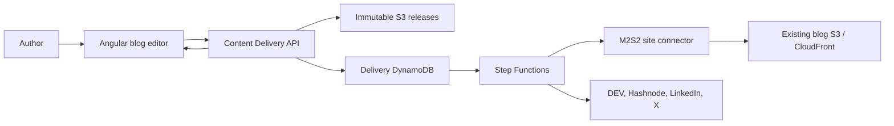

# M2S2 Web Platform Content Delivery Integration: Architecture and Roadmap

## Document status

- Status: proposed implementation baseline
- Repository: existing `m2s2-platform` monorepo
- Frontend: `apps/web` Angular application
- Current blog API: `apps/api/dashboard`
- New dependency: `apps/content-delivery`
- Primary rule: content delivery owns immutable releases and destination execution

## 1. Executive decision

The M2S2 Angular application remains the authoring and product experience. The new content-delivery
project becomes the publishing system of record. Pressing Publish uploads assets, creates an
immutable release, submits selected connection IDs, and receives a deployment run ID. A Step
Functions workflow publishes the canonical M2S2 representation and fans out to selected external
destinations.

The current dashboard Lambda directly writes post JSON, index JSON, sitemap, and CloudFront
invalidation. Move that behavior into the managed `m2s2site` connector. The public blog remains
S3/JSON-driven, so the reading experience need not change.

## 2. Current state and migration pressure

Current publish behavior:

```text
Angular BlogEditor
  -> POST/PUT /admin/blog with article and base64 cover image
  -> dashboard Lambda writes cover image
  -> writes post JSON
  -> rewrites index JSON
  -> rewrites sitemap
  -> invalidates CloudFront
  -> returns message
  -> editor navigates away
```

The sequential S3/index/sitemap operations are not one transaction. A failure can leave a post
written but unindexed or otherwise partially applied. The synchronous response also cannot represent
external fan-out, retries, approvals, or partial success. The new workflow fixes this by treating the
M2S2 website as one managed destination with durable run/target state.

## 3. Product exposure

Initial routes and domains:

```text
m2s2.io/content-delivery              Product explanation
m2s2.io/pricing                       Plan comparison
m2s2.io/docs/content-delivery         Initial documentation, or docs subdomain later
m2s2.io/admin/blog                    Existing authoring experience
m2s2.io/delivery                      Authenticated delivery portal shell
api.m2s2.io/v1/content-delivery/...   Option A: shared API domain
delivery-api.m2s2.io/v1/...           Option B: separate API domain
```

Prefer a separate API Gateway/CDK stack even if the API is initially mapped under `api.m2s2.io`.
Keep the public product path independent from the final brand/domain so it can move later.

### Portal navigation

```text
Overview
Content
Deployments
Draft approvals
Connector catalog
Connections
Policies and schedules
Team and workspaces
Developer tokens and webhooks
Usage and billing
```

## 4. System boundary



### Angular/web platform owns

- Article editing and in-browser draft state.
- Authoring validation and preview.
- Target selector and publishing UX.
- Product pages, onboarding shell, connection forms, approvals, usage, and billing UX.
- Cognito sign-in experience.
- Public blog reading routes and presentation.

### Content delivery owns

- Content items and immutable releases.
- Presigned asset upload sessions.
- Workspace connections and credential references.
- Connector catalog/implementations.
- Step Functions execution and durable run/target status.
- Canonical M2S2 site writes and external delivery.
- Generated social drafts and approval state.
- Subscription, entitlements, usage, audit, and webhooks.

### Prohibited coupling

- No destination credentials in Angular, browser storage, runtime config, or dashboard tables.
- No frontend access to Step Functions, DynamoDB, S3 release buckets, or Secrets Manager.
- No direct manipulation of delivery table records from dashboard handlers.
- No shared business-state table with the existing `m2s2-data` table.
- No treating cached UI status as authoritative for retries or approvals.

## 5. Authentication and tenancy

Reuse the existing Cognito user pool and current Angular Amplify session. Do not recreate the pool.
The content API uses a Cognito authorizer/audience supported by the current session or an additional
web app client if required.

### Authorization model

- Cognito authenticates a stable `sub`.
- Delivery membership records authorize organization/workspace roles.
- The current Cognito `admin` group can bootstrap the initial M2S2 owner but is not the SaaS tenant
  authorization model.
- The service validates connection/release/run ownership for every request.
- Billing, secret rotation, connector publication, and destructive unpublish require explicit roles.

### Initial M2S2 mapping

Seed:

```text
Organization: M2S2 Engineering Group
Workspace:    m2s2-site
Connection:   m2s2.io canonical website
Owner:        existing M2S2 admin Cognito subject
```

Future users create organizations/workspaces through onboarding. The Angular app never assumes its
internal IDs equal content-delivery IDs.

## 6. Editor publishing workflow

### Connection selection

The workspace connection settings determine what is available:

```text
M2S2 website     Connected and verified
DEV              Connected and verified
Hashnode         Connected and verified
LinkedIn         Connected, approval required
X                Not connected
```

The editor shows only enabled, verified connections the user may use:

```text
Publish this release to

[x] M2S2 website       Required
[x] DEV
[x] Hashnode
[ ] LinkedIn           Generates an approval draft
```

A policy supplies defaults; the publish dialog may override allowed selections.

### Publish sequence

1. Validate the editor draft against the canonical release schema.
2. Compute reading-time/derived authoring metadata where appropriate.
3. Request presigned upload sessions for new cover/inline assets.
4. Upload assets directly; do not base64-embed large images in the API request.
5. Create or reuse the immutable release with an idempotency key.
6. Submit a deployment request with selected connection IDs.
7. Receive `202 Accepted`, `releaseId`, and `runId`.
8. Display the run panel immediately; do not navigate away automatically.
9. Poll the authoritative status endpoint initially.
10. Show per-target outcome, remote URL, retry, and approval actions.

Example request:

```json
{
  "operation": "create",
  "targets": [
    {"connectionId": "con_m2s2"},
    {"connectionId": "con_devto"},
    {"connectionId": "con_hashnode"}
  ]
}
```

### Idempotency

Release key:

```text
m2s2-web:{workspace-id}:{article-id-or-slug}:{normalized-source-digest}
```

Deployment key:

```text
m2s2-web:{workspace-id}:{release-id}:{operation}:{selected-target-digest}
```

Disable repeated button clicks while a request is pending, but rely on server idempotency for
correctness.

## 7. Canonical M2S2 site connector

The managed `m2s2site` connector replaces the existing blog-writing responsibilities:

1. Load the immutable release and assets.
2. Produce the current `BlogPost` JSON representation.
3. Write the post object to the existing content bucket.
4. Update the derived blog index in a serialized/idempotent manner.
5. Regenerate sitemap content.
6. Write the sitemap to the current web bucket.
7. Invalidate the required CloudFront paths.
8. Return the canonical URL as the remote publication URL.

The connector needs narrow S3 and CloudFront permissions equivalent to the current dashboard blog
handler. Remove those permissions from the dashboard Lambda after migration.

### Concurrency

Index and sitemap updates are shared site resources. Ensure that two simultaneous article
deployments cannot overwrite each other's changes. Options:

- route M2S2 site target work through a site-scoped FIFO/lock;
- use a DynamoDB conditional site-index version and retry reconstruction;
- store canonical site index state in the delivery table and derive S3 index/sitemap snapshots.

Record the selected method in an ADR. Do not rely only on S3 last-writer-wins behavior.

### Compatibility migration

During migration, `/admin/blog` may delegate to the delivery application and translate its response.
Do not execute both old and new publishers for the same click. Use a workspace feature flag:

```text
legacy_blog_publish | content_delivery_publish
```

After the Angular editor uses the delivery API and production stability criteria are met, remove old
blog create/update/delete writes from the dashboard Lambda. Public blog reads remain unchanged.

## 8. Angular frontend architecture

### Runtime configuration

Add non-secret fields to runtime config:

```json
{
  "platformApiUrl": "https://api.m2s2.io",
  "contentDeliveryApiUrl": "https://delivery-api.m2s2.io/v1",
  "contentDeliveryEnabled": true
}
```

Never add client secrets, destination tokens, Stripe secret keys, or service tokens.

### Services

```text
ContentDeliveryService
- listWorkspaces()
- listConnectors()
- listConnections()
- createAssetUploads()
- createRelease()
- createDeployment()
- getDeployment()
- listTargets()
- retryTarget()
- listDrafts()
- updateDraft()
- approveDraft()
- rejectDraft()
- getEntitlements()
- createCheckoutSession()
- createBillingPortalSession()
```

Centralize authenticated calls and problem-response mapping. Do not spread API URL construction and
token extraction across components.

### Editor state

Add signals/state for:

```text
availableConnections
selectedConnectionIds
uploadProgress
releaseId
runId
runStatus
targetStatuses
preflightChecks
draftsAwaitingApproval
safeError
```

Persist a recoverable recent `runId` locally only for navigation convenience. The service remains
authoritative.

### Publishing panel

```text
Release 7                         Created 10:42 AM

M2S2 website    Published         View
DEV             Published         View
Hashnode        Rate limited      Retry
LinkedIn        Awaiting review   Review
```

Actions:

- view release/source digest;
- view preflight check and safe error;
- open remote publication;
- retry one target;
- review/edit/approve/reject draft;
- start an update release;
- explicitly unpublish a target;
- view run and audit history.

Unpublish and rejection require clear confirmation. Approval displays the exact text that will be
posted.

### Status updates

Use bounded polling for MVP. Stop or reduce polling in terminal states. Add server-sent events later
only when measured UX/load justifies it. Delivery webhooks are for external server consumers, not a
replacement for authenticated browser state APIs.

## 9. Connector portal

### Managed connectors

The portal renders built-in connectors and schema-driven connection forms:

```text
DEV       API key, organization, draft default
Hashnode  Token, publication ID
LinkedIn  OAuth and member/organization target
X         OAuth and account target
M2S2      Site target seeded by platform
```

Secret fields are write-only. After save, show configured/version/last-verified metadata, never the
value.

### User-defined connectors

Later, an advanced area supports:

- draft declarative connector definition;
- config/secret schemas and schema-driven form preview;
- allowed-host/network policy;
- operation templates and response mappings;
- validation and test connection;
- immutable version publication;
- organization/workspace ownership;
- connection upgrade to a newer version;
- health and audit history.

Do not expose arbitrary code upload. Customer-hosted remote connectors use a separate signed-agent
onboarding workflow.

## 10. AI draft approval

For LinkedIn/X approval targets:

1. Step Functions invokes generation.
2. Service stores a versioned draft tied to the immutable release digest.
3. Target becomes `awaiting_approval`.
4. Editor opens the exact draft.
5. User may edit with optimistic concurrency.
6. Approve/reject API validates role, version, and staleness.
7. Approval resumes the Step Functions callback branch.
8. Connector publishes and target status updates.

The raw task token is never sent to Angular. The API operates on an opaque draft/approval ID.

## 11. Billing integration

The content-delivery application owns Stripe and entitlement state. Angular initiates hosted flows:

```text
Pricing page
  -> sign in / select organization
  -> content API creates Checkout session
  -> redirect to Stripe Checkout
  -> Stripe webhook updates subscription
  -> return page polls subscription/entitlements
```

Do not grant access from Checkout return query parameters. Billing settings request a short-lived
Customer Portal URL from the content API.

Translate `entitlement_required` into a specific explanation and upgrade link. Local blog editing and
preview remain available even when a hosted publishing entitlement is unavailable.

## 12. Failure behavior

| Failure | Web behavior |
|---|---|
| Asset upload fails | Retry only failed upload; do not create release until required assets verify |
| Release request response lost | Retry with same idempotency key |
| Deployment accepted | Show run ID immediately; asynchronous success is not implied |
| Required preflight blocked | Show all checks; no destination writes occur |
| One target fails | Show partial failure and retry only that target |
| Step Functions execution fails | Show safe workflow failure and support/reference ID; reconciler repairs domain status |
| Approval becomes stale | Disable approval and request regeneration against new release |
| Connection expires | Link to reconnect/verify flow |
| Subscription past due | Preserve permitted reads/export; block new paid operations consistently |

## 13. Security and privacy

- Treat Markdown, rendered HTML, API errors, custom connector metadata, and generated drafts as
  untrusted.
- Sanitize previews and public rendering.
- Apply CSRF/session protection appropriate to the current Cognito/Angular model.
- Use short-lived access tokens with the delivery audience.
- Never expose service credentials, Step Functions tokens, secret ARNs, or raw provider responses.
- Bound file size/type, request body, and polling behavior.
- Audit publish, retry, approve, reject, connection, billing, connector publication, and unpublish.
- Disclose when content is sent to AI and destination providers.

## 14. Testing

### Unit/component

- Connection selector and policy defaults.
- Canonical draft mapping and validation.
- Asset upload state and recovery.
- Run/target status mapping.
- Approval version/staleness behavior.
- Problem-code to actionable UX mapping.
- Feature-flag legacy/new path selection.

### Contract

- Angular client versus pinned OpenAPI.
- Canonical release/digest fixtures shared with Go service and Rust CLI.
- Additive response compatibility.
- Stable connector/target status enumerations.

### Integration

- Cognito token sent to correct delivery audience.
- Presigned uploads and release creation.
- Duplicate publish click produces one semantic release/run.
- Required preflight blocking and no writes.
- Partial success and one-target retry.
- Draft edit/approval conflict.
- Checkout/portal redirects through a fake billing client.

### End-to-end

- Publish from editor to M2S2 site through Step Functions.
- Fan out to test DEV/Hashnode accounts.
- Observe status without leaving editor.
- Approve a generated draft.
- Repair an expired connection.
- Exercise an entitlement limit and upgrade route.

Ordinary web CI uses a stub/ephemeral delivery environment and no production destination/Stripe
credentials.

## 15. CI/CD changes

- Add `apps/content-delivery/**` to change detection and full/deployment modes.
- Generate or verify the Angular delivery client from pinned OpenAPI.
- Test shared canonical fixtures and status/error mappings.
- Build content-delivery Lambda binaries via reusable script/matrix.
- Build and validate the Step Functions ASL definition.
- Add `M2S2ContentDeliveryStack` to CDK build, synth, diff, deploy, and rollback paths.
- Add runtime `contentDeliveryApiUrl` injection.
- Deploy service infrastructure/API before enabling frontend feature flag.
- Run a non-production synthetic M2S2 site deployment after deploy.
- Keep the previous dashboard blog path available only through the migration stability window.

## 16. Roadmap

### Phase 0 — contract and feature boundary

- Define canonical `BlogDraft` to `ContentRelease` mapping and golden fixture.
- Decide shared versus separate API domain and Cognito web client/audience.
- Seed M2S2 organization/workspace/connection.
- Add Angular runtime configuration and feature flag.
- Add generated/contract-tested client shell.

Exit: signed-in M2S2 admin can call an authenticated content-delivery development endpoint.

### Phase 1 — canonical site migration

- Replace base64 cover upload with presigned asset upload.
- Create immutable release and selected-target deployment from editor.
- Implement M2S2 site connector with concurrency-safe index/sitemap update.
- Add run/target panel and bounded polling.
- Keep `/admin/blog` compatibility delegation behind feature flag.

Exit: M2S2 site production publishing runs through Step Functions with recoverable state.

### Phase 2 — managed external delivery

- Add connector catalog and connection screens for DEV/Hashnode.
- Add publish selection, preflight display, partial failure, remote links, and per-target retry.
- Add run history and explicit update/unpublish.
- Remove old dashboard S3 writer and its IAM after stability criteria.

Exit: the editor reliably fans one release to M2S2, DEV, and Hashnode.

### Phase 3 — social generation and approval

- Add LinkedIn/X connection UX.
- Add draft review/edit/regenerate/approve/reject and stale-state display.
- Resume Step Functions through opaque approval APIs.
- Add notification for approval-required/terminal states.

Exit: the complete author workflow is available in the web application.

### Phase 4 — product portal and commerce

- Product/pricing/docs pages.
- Organization/workspace onboarding and invitations.
- Connector catalog, policies, developer tokens/webhooks.
- Stripe Checkout, Customer Portal, usage, entitlement, lifecycle messaging.

Exit: a customer can discover, purchase, configure, publish, and manage the service from the web.

### Phase 5 — custom connectors and decoupling proof

- Declarative connector builder/version lifecycle and security validation.
- Organization/workspace connector ownership.
- Customer-hosted remote connector onboarding later.
- Integrate a reference editor unrelated to M2S2 through the same API.

Exit: M2S2 web is demonstrably one source client, and an advanced user adds a connector without a
service code deployment.

## 17. Definition of done

The integration is complete when the editor creates digest-verified immutable releases, selects
workspace connections, receives durable Step Functions run status, safely uploads assets, controls
retry/approval/unpublish, stores no destination secrets, publishes the existing S3/CloudFront blog
through the managed M2S2 connector, and the same API works for a non-M2S2 editor.
